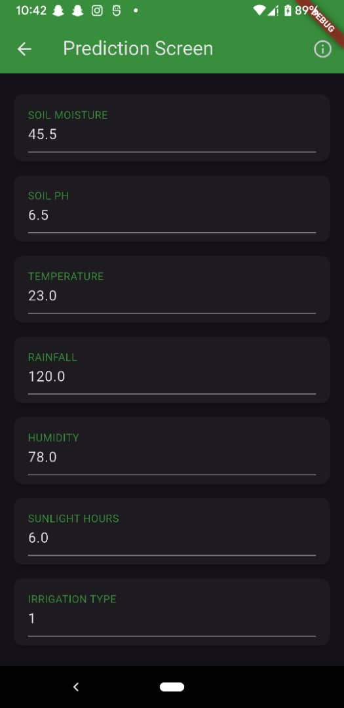
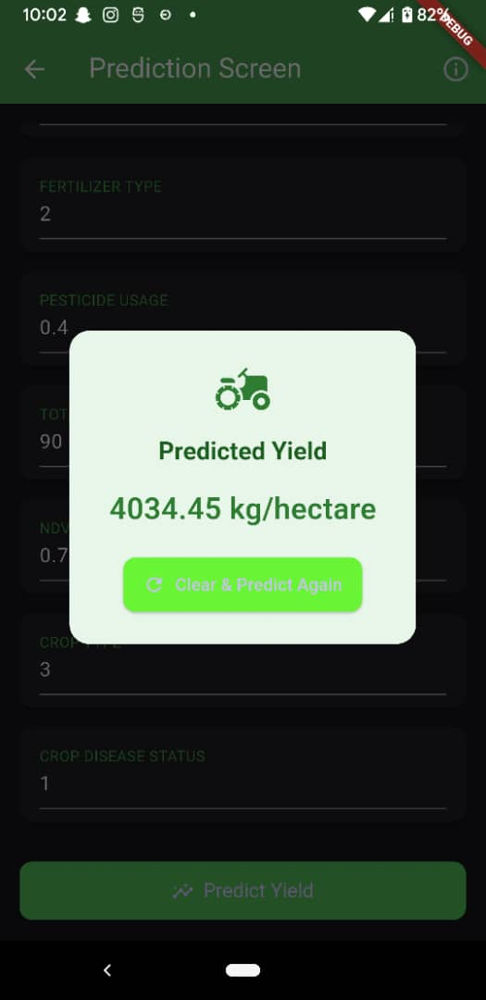

# CropVision

## Mission

Empowering African farmers with smart crop yield predictions using real-time environmental and soil data.  
Built with machine learning and mobile-first principles to bring AI to the fields.

---
## About Dataset
The dataset simulates real-world smart farming operations powered by IoT sensors and satellite data. It captures environmental and operational variables that affect crop yield across 500 farms located in regions like India, the USA, and Africa.

The dataset, **Smart_Farming_Crop_Yield_2024.csv**, includes over 10,000 samples across different regions, featuring:
- Climate attributes: `rainfall_mm`, `temperature_C`, `humidity_%`
- Soil attributes and farming timelines: `sowing_date`, `harvest_date`
- Geolocation: `latitude`, `longitude`, `region`
- Target: `yield_kg_per_hectare`

Designed to reflect modern agritech systems, the data is ideal for:

Predictive modeling using ML/AI
Time-series analysis
Sensor-based optimization
Environmental data visualizations
Crop health analytics

Link to the dataset https://www.kaggle.com/datasets/atharvasoundankar/smart-farming-sensor-data-for-yield-prediction

---

---

##  Key Visualizations for Model Training

The following visualizations were generated to understand relationships between features and guide model design:

### 1. Correlation Heatmap

The heatmap shows how strongly features like rainfall, temperature, and humidity are correlated with crop yield. This helped us prioritize impactful features during model training.


---

### 2. Yield Distribution Histogram

Understanding the distribution of the target variable (`yield_kg_per_hectare`) helps in selecting appropriate loss functions and transformations.


---

## Public API Endpoint

- Base URL: https://cropvision.onrender.com 
- Swagger UI: https://cropvision.onrender.com/docs

The `/predict` endpoint accepts 13 input features and returns the predicted crop yield in kilograms per hectare.

---

## Video Demo

Watch the full 5-minute demonstration video on YouTube:  
**[Demo Video Link](https://your-youtube-link-here)**

The video includes:
- How to use the mobile app
- Testing the API via Swagger UI
- Training and comparing models in Jupyter Notebook
- Deployment explanation and workflow

---

## How to Run the Mobile App

### 1. Requirements

- Flutter 3.x
- Android Studio or VS Code
- A device or emulator
- Internet connection

### 2. Steps to Run

```bash
git clone https://github.com/elyse003/CropVision.git
cd CropVision/cropvision_app
flutter pub get
flutter run
````

You can use a real Android device or emulator (e.g., Pixel 3a) to run the app.

### 3. App Features

* Prediction Screen: Accepts 13 input values and calls the backend API
* About Screen: Displays the mission and purpose of the app
* Splash Screen: Initial launch screen for branding
* Network call to FastAPI backend for crop yield prediction
* Results are shown clearly and rounded for readability

---

## Folder Structure

```
CropVision/
├── linear_regression/
│   ├── model_training.ipynb
│   └── African_Smart_Crop_yield_2024.csv
├── backend/
│   ├── api.py
│   ├── requirements.txt
│   ├── best_model.pkl
│   ├── scaler.pkl
│   └── encoders.pkl
└── cropvision_app/
    ├── lib/
    │   ├── main.dart
    │   └── screens/
    │       ├── splash_screen.dart
    │       ├── about_screen.dart
    │       └── prediction_screen.dart
    └── images/
        ├── splash.jpg
        ├── about.jpg
        ├── predict.jpg
        └── result.jpg
```

---

## Screenshots

### Splash Screen


### About Screen


### Prediction Form



### Prediction Result



---

A project by : Marie Elyse UYIRINGIYE


---

Thank you for exploring CropVision.

```